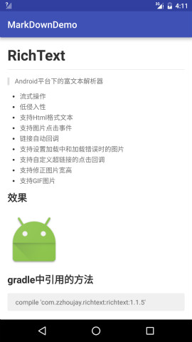

# MarkDown

> Android平台的原生Markdown解析器，已整合进 [RichText](https://github.com/zzhoujay/RichText)

* 由markdown文本直接转换为Spanned，快捷高效
* 不依赖特定控件，低侵入性
* 遵循 Github Flavored Markdown 标准

### 效果展示



### 使用

```
Markdown.fromMarkdown(text,imageGetter,textView);
```
**注意：** 此方法需要在textView的Measure完成后调用，因为需要获取textView的宽高

例子：
```
textView.post(new Runnable() {
     @Override
     public void run() {
     Spanned spanned = MarkDown.fromMarkdown(stream, new Html.ImageGetter() {
           @Override
           public Drawable getDrawable(String source) {
                 Drawable drawable = getResources().getDrawable(R.mipmap.ic_launcher);
                 drawable.setBounds(0, 0, 400, 400);
                 return drawable;
           }
     }, textView);
     textView.setText(spanned);
}
```

### 在RichText中使用

[RichText](https://github.com/zzhoujay/RichText) 包含了一些对图片和其它东西的处理，使用更简单
```
RichText.fromMarkdown(markdown).into(textView);
```

### Use in Gradle

`compile 'com.zzhoujay.markdown:markdown:0.0.12'`


### 已知问题

* 暂不支持使用反斜杠 \\ 转义
* 不支持表格
* TextView设置了`setTextIsSelectable(true)`后和长按事件冲突
* 暂时不支持内嵌html


### 后续计划

* 修复一些已知问题
* 加入多选框支持
* 增加对简单html标签的支持

### License

```
The MIT License (MIT)

Copyright (c) 2015 zzhoujay

Permission is hereby granted, free of charge, to any person obtaining a copy
of this software and associated documentation files (the "Software"), to deal
in the Software without restriction, including without limitation the rights
to use, copy, modify, merge, publish, distribute, sublicense, and/or sell
copies of the Software, and to permit persons to whom the Software is
furnished to do so, subject to the following conditions:

The above copyright notice and this permission notice shall be included in all
copies or substantial portions of the Software.

THE SOFTWARE IS PROVIDED "AS IS", WITHOUT WARRANTY OF ANY KIND, EXPRESS OR

IMPLIED, INCLUDING BUT NOT LIMITED TO THE WARRANTIES OF MERCHANTABILITY,
FITNESS FOR A PARTICULAR PURPOSE AND NONINFRINGEMENT. IN NO EVENT SHALL THE
AUTHORS OR COPYRIGHT HOLDERS BE LIABLE FOR ANY CLAIM, DAMAGES OR OTHER
LIABILITY, WHETHER IN AN ACTION OF CONTRACT, TORT OR OTHERWISE, ARISING FROM,
OUT OF OR IN CONNECTION WITH THE SOFTWARE OR THE USE OR OTHER DEALINGS IN THE
SOFTWARE.
```

_by zzhoujay_
